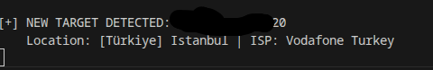

# Speech-ip-leaker
Educational STUN traffic analysis tool
# 📡 STUN Recon

Real-time STUN (Session Traversal Utilities for NAT) traffic analyzer that detects external IP addresses from UDP packets and retrieves geolocation and ISP information.

> ⚠️ This project is intended for educational and authorized security testing purposes only.

---

## 📌 What is STUN?

STUN (Session Traversal Utilities for NAT) is a protocol that allows devices behind NAT to discover their public IP address and port.

It is commonly used in:

- WebRTC applications
- VoIP systems
- Video conferencing
- Peer-to-peer connections
- Online gaming

STUN helps answer the question:

> "How does the internet see me?"

---

## 🎯 Project Purpose

STUN Recon passively monitors STUN traffic on a selected network interface and extracts public IPv4 addresses from STUN responses.

When a new IP is detected, the tool automatically retrieves:

- 🌍 Country
- 🏙 City
- 🌐 ISP (Internet Service Provider)

This project was created as a learning exercise in:

- Network traffic analysis
- STUN protocol inspection
- Subprocess handling in Python
- API integration
- Real-time packet filtering

---

## 🛠 Features

- Real-time STUN packet capture via Tshark
- Automatic public IP detection
- Self-IP filtering
- Duplicate IP filtering
- Geolocation lookup
- Rate limit handling (HTTP 429)
- Lightweight and minimal dependencies
- Clean logging output

---

## ⚙️ Requirements

### System Dependencies

- Python 3.8+
- Tshark (Wireshark CLI tool)
- Linux-based system recommended

---

## 📦 Installation

Clone the repository:

```bash
git clone https://github.com/AydoganCan60/Speech-ip-leaker.git
cd Speech-ip-leaker
```
Install Python dependencies:
```bash
pip install -r requirements.txt
```
Install Tshark (Debian/Ubuntu):
```bash
sudo apt update
sudo apt install tshark
```
Verify installation:
```bash
tshark -v
```
🚀 Usage

Run the script:
```bash
python3 main.py
```
Available network interfaces will be displayed.
Example:
```
1. eth0
2. wlan0
3. lo
```
Enter the interface index you want to monitor.

The tool will begin capturing STUN traffic and display newly detected external IP addresses in real time.


-------------------------------------------

🔍 How It Works

Detects your public IP using api.ipify.org

Starts Tshark capture with:

UDP filter

STUN response filter

Extracts IPv4 addresses from STUN attributes

Queries ip-api.com for geolocation data

Displays formatted results

-------------------------------------------
🔒 Security Notice

This tool does NOT exploit vulnerabilities.

It performs passive analysis of network traffic.

No packet injection or manipulation is performed.

-------------------------------------------
⚠️ Legal Disclaimer

This software is provided strictly for:

Educational purposes

Authorized penetration testing

Network monitoring in environments you own or have explicit permission to test

Unauthorized packet capture, surveillance, or monitoring may violate local, national, or international laws.

The developer assumes no responsibility for misuse or damage caused by this tool.

Always obtain proper authorization before capturing network traffic.

-------------------------------------------
📜 License

This project is licensed under the MIT License.

-------------------------------------------
👨‍💻 Author

Developed by aydogan60

-------------------------------------------
If you found this project useful, consider giving it a ⭐ on GitHub.
